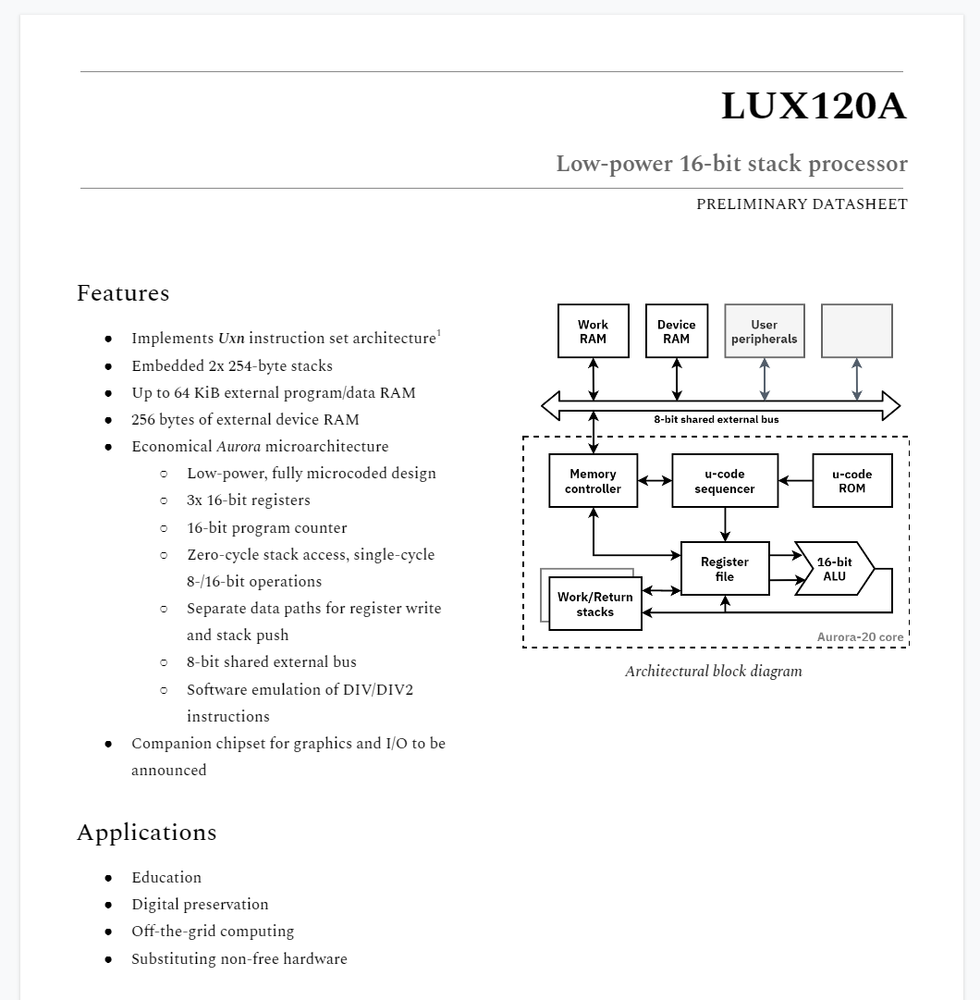
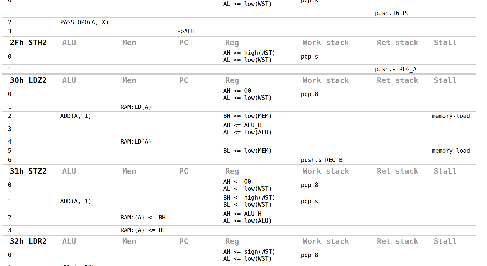

This is the repository of the Lux CPU project.

Currently it only implements one core, _Aurora-20_, which will serve as the basis of the LUX120A CPU. Documentation is TBD.

After cloning the repository, you can execute

    make test

to run some tests. You will need `unxasm` and Python 3.9ish in your PATH.

To recompile the ucode you will also need the `hy` package (precompiled ucode is provided for convenience).

## Details

The core microarchitecture is implemented in `aurora_sim.py`.

It can be executed in two ways:

    ./aurora_sim.py <rom>           # Console output (#18 DEO) goes directly to stdout
    ./aurora_sim.py -hex <rom>      # output is printed in hexadecimal, handy for tests

No other I/O is implemented.

_aurora_sim_ assumes that `fw/fw.rom` had been built (it contains implementation of DIV/DIV2 instructions). Makefile will normally take care of this. Note that the address range 0xFF80~0xFFFF is taken up by these routines.

Not yet implemented:
- stack under/overflow traps
- _k_ & _r_ variants of DIV/DIV2
- error code on DIV/0 trap

Implemented only as high-level model:
- microcode sequencing
- multiplication

Unlikely to make it into Aurora:
- hardware division
- stack remapping to RAM

Note that I/O Devices are outside the scope of this project. An address/data bus will be exposed to attach them, though.

If you are interested in the microarchitectural details, you can also generate a readable listing of the entire microcode: `make ucode_au20.html`

